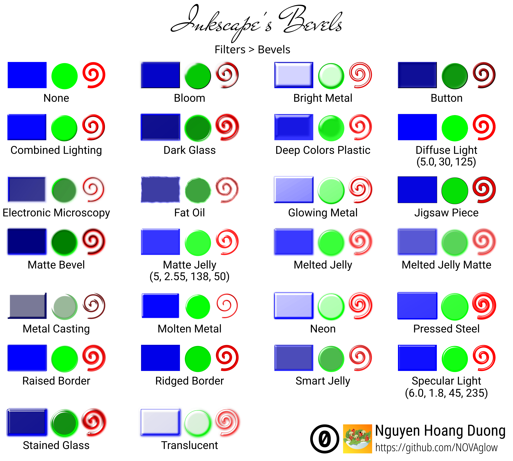
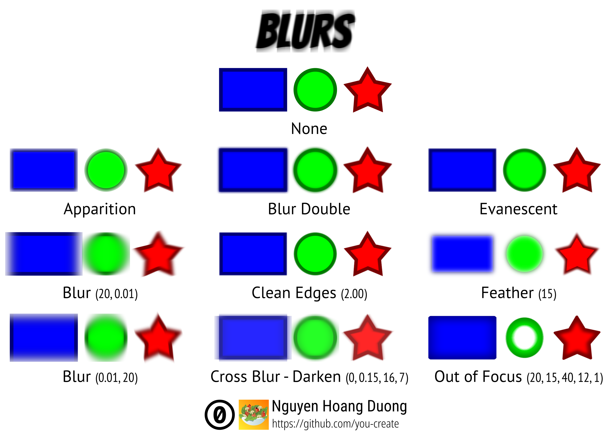

Inkscape cheat sheets
====================

This repository contains cheat sheets for Inkscape users. The cheat sheets were
originally made as SVGs. They were then exported to PNGs and PDFs.

Inkscape is a professional vector graphics drawing tool. What especially nice
is that Inkscape is libre & open-source software, and it is used and beloved by
free software lovers, like the people at The Fedora Project, or, maybe you!

Available cheat sheets
----------------------

> **Note**: In cells of the "Contributors" column, the original authors' names
are written in **bold**.

<!-- Generated with chshlistgen.sh -->

|Preview|Title|Description|Contributors|License|
|:---:|:---:|---|:---:|:---:|
| [SVG](src/bevels.svg) -- [PNG](png/bevels.png) -- [PDF](pdf/bevels.pdf)|Inkscape 0.92.3's Bevels|A showcase of existing bevels in Inkscape 0.92.3.|**Nguyen Hoang Duong**|[Creative Commons Zero v1.0 Universal](LICENSES/CC0)|
| [SVG](src/blurs.svg) -- [PNG](png/blurs.png) -- [PDF](pdf/blurs.pdf)|Blur effects in Inkscape 0.92.3|A showcase of existing blur effects in Inkscape 0.92.3.|**Nguyen Hoang Duong**|[Creative Commons Zero v1.0 Universal](LICENSES/CC0)|

Directory structure
-------------------

- `src/`: Contains SVG source of the cheat sheets
- `png/`: Contains exported PNGs of the cheat sheets
- `pdf/`: Contains exported PDFs of the cheat sheets
- `LICENSES/`: Contains (copies of) all the licenses used by all of the cheat
sheets
- `chshlistgen.sh`: Shell script that is used to generate the table you see in
the prior section
- `index`: Text file that indexes the metadata of all cheat sheets and is read
by `chshlistgen.sh`
- `CONTRIBUTING.md`: Contributing guidelines for this repository
- `README.md`: Overview information for this repository (which is the document
that you're reading)

Contributing
------------

- Suggest a new cheat sheet by [opening a new issue][o-issh]
- Submit your own cheat sheets or your changes to existing cheat sheets by
opening a pull request

For a lot more detailed information, take the time to read [the contributing
guidelines](CONTRIBUTING.md).

Thank you!

[o-issh]: https://github.com/svgsalad/inkscape-svg-cheat/issues/new

License
-------

Different cheat sheets are licensed under different licenses. Each cheat sheet
entry in the section "Available cheat sheets" (above) is written along with its
license's name. If you wish to download and use a cheat sheet, please read its
license first (or at least a TL;DR version of it) to know your rights. All
licenses used are placed inside the `LICENSES` folder.

Other documents within this repository (like this README document you're
reading) are released under the terms of [Creative Commons Zero 1.0
Universal][cc0-link] (except for `LICENSE`).

[cc0-link]: https://creativecommons.org/publicdomain/zero/1.0/
